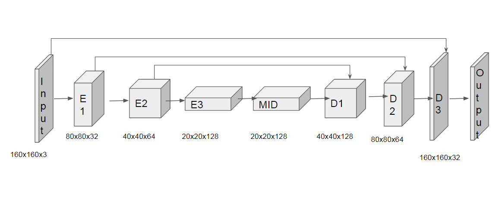

## Project: Robotics Quadcopter Follow Me Deep Learning

---


# Required Steps for a Passing Submission:
1. In this project, we have to build and train a Fully Convolutional Network using Keras. The Network is trained to identify a target person (red hair, red shirt) from an image.
2. Download all the necessary image and masked image files mentioned in README.md(./README.md).
3. Complete all the TODO steps in `model_training.ipynb` file including the creation of Fully Convolutional Network.
4. Set the hyperparameters and tune them if needed.
5. Train the model and save it.
4. Make predictions on the validation dataset. These predictions can be compared to the mask images, which are the ground truth labels, to evaluate how well your model is doing under different conditions.
6. Evaluate the model and print out the evaluation.
7. Write it up.
8. Congratulations!  Your Done!

## [Rubric](https://review.udacity.com/#!/rubrics/1534/view) Points
### Here I will consider the rubric points individually and describe how I addressed each point in my implementation.

---
### Writeup / README

#### 1. Provide a Writeup / README that includes all the rubric points and how you addressed each one.  You can submit your writeup as markdown or pdf.

You're reading it! Below I describe how I addressed each rubric point and where in my code each point is handled.

#### 2. Explain this project.

The goal of this project is to implement, train, tune hyperparameter and evaluate a deep learning neural network to have a drone to identify and track a target in simulation. The target in this project is a recognizable human being i.e. "me" hence the `follow me`.

This project uses Fully Convolutional Networks (FCNs) in order to identify various parts of an image captured by the quadcopter a general person ("me"). A number of hyperparameters need to be tuned in order to get a good model. The metric used to evaluate the quality of the model is the IOU (intersection over union) metric. This metric takes the intersection of the prediction pixels and ground truth pixels and divides it by their union.The model is trained to allow the drone to follow a certain target person, which is the person marked red in the image below.

#### 3. Explain the Fully Convolutional Network.


The Fully Convolutional Network Network (FCN) is implemented using Tensorflow and Keras in [model_training.ipynb](./code/model_training.ipynb).


Fully Convolutional Networks (FCNs) is built only from connected layers, such as convolution, pooling and upsampling. FCNs don't have any dense layer which helps in reducing the number of parameters and computation time. Also, the network can work regardless of the original image size, without requiring any fixed number of units at any stage, given that all connections are local. To obtain a segmentation map (output), segmentation networks usually have 2 parts :

- Downsampling path : capture semantic/contextual information
- Upsampling path : recover spatial information

The FCN that we have built is composed of `an input layer`, `3 encoder layers`, `a middle layer (1x1 convolution)`, `3 'decoder' layers`, and `an output layer`. Following is a description of each of these layers:

##### Input layer: This is just the normal input layer where we supply the images captured by the quadcopter to the FCN  and the image is being processed.

##### Encoder layers: This is where the encoding of the images happens. This layer reduces the spatial dimension of the images. We do end up preserving spatial information from the image, and thus this approach helpful for semantic segmentation of images. Owing to its lower computational cost, we use depthwise separable convolutions for building the encoder layers. We encode the input from the input layer 3 times with the parameters mentioned below. We encode the  The entire FCN comprises of a convolution performed over each channel of an input layer and followed by a 1x1 convolution that takes the output channels from the previous step and then combines them into an output layer. This leads to a reduction in the number of parameters to be tuned.

We encode images for the network to essentially learn details about the image for
classification. The encoder has pooling which down-samples the image. This is used so that the model will generalize to images it hasn’t seen before and reduce the risk of overfitting. The downside of this is that it loses information and reduces the spatial dimension. The role of the decoder is to recover this spatial dimension. The decoder
part maps the low resolution encoder feature maps to full input resolution feature maps for pixel-wise classification.

The FCN implemented uses the following parameters for encoding layer
```python
stride = 2
filter = 32 # Encoding layer 1
filter = 64 # Encoding layer 2
filter = 128 # Encoding layer 3
```

##### Middle layer: This is a pure 1x1 convolutional layer with a kernel size of 1 and a stride of 1. In a Fully Connected Network we just connect the encoder to the decoder but we end up losing spatial information because pixel location information is lost. This problem is eliminated by introducing this 1x1 convolution middle layer. Hence, to connect the the encoder layers to the decoder layers, instead of a fully connected layer, we use a 1x1 convolutional layer to retain the spatial information.

##### Decoder layers: This is the exact oppsite of encoding layer. The decoding layer provides Bilinear​ ​ Interpolation Upsampling by which it converts the ouput of the encoding and convolution layer back to higher dimension. The method used for achieving upsampling in this process is called bilinear upsampling. Bilinear upsampling is a resampling technique that utilizes the weighted average of four nearest known pixels, located diagonally to a given pixel, to estimate a new pixel intensity value.

In all these layers, we use batch normalization. This means that instead of just normalizing the inputs to the network, we normalize the inputs to each layer within the network. During training, each layer's inputs are normalized using the mean and variance of the values in the current mini-batch. The benefits of doing this includes higher learning rates, faster learning, and an element of regularization for the network parameters.

Some skip connections are introduced between the encoder layer and the decoder layer to improve the resolution of the results.

The figure below shows the architecture of the FCN implemented for this model:



#### 4. Training, Hyperparameter Tuning, Predicting and Scoring.

##### Model Hyperparameters

##### Optimizer Algorithm

I used the Adam Optimizer for a 1 trials with a small learning rate of 0.002 suggested in the lessons. A high learning rate might overshoot the desired output. I tried out the Nadam Optimizer which is an Adam Optimizer with  Nesterov Accelerated radient (NAG). NAG slows down momentum by using expected future position of the parameters. Momentum makes it converge more quickly and actually increased the score from about 0.36 to 0.43 with no other changes.

Both the Adam and Nadam algorithms are Adaptive Gradient Algorithms as they maintain a per-parameter learning rate. This improves performance on problems with sparse gradients like this one. Also both Adam and Nadam relies on Root Mean Square Propagation (RMSProp), which also maintains per-parameter learning rates, adapted based on the average of recent magnitudes of the gradients for the weight.

##### Learning Rate

An optimal learning rate is important for fast and stable convergence.

Two issues with a small learning rate are:
1. slow convergence
2. possibility of getting stuck on a local minimum.

Issue with a higher learning rate is that it will cause instabilities.

I thought about using a higher learning rate but then I didn't want to spend a lot of training my algo again if I didn't get a good model out of it. So, I went with 0.02 for both Adam and Nadam optimizers which was suggested in the lessons and in slack. I didn't think about changing it at all.

##### Batch Size

Evaluating the​ ​ gradient​  of ​the​ ​entire​ ​dataset​ ​in one go very expensive​, memory consuming, slow and pragmatically speaking infeasible.​ ​So, we break it all down into batches, all distributed systems work like this. In order to be able to use all samples, the number of steps needed is inversely proportional to the step size. Therefore, there is an optimal batch size to be used for efficient training of the network. Optimizing​ ​ the​ ​exact​​ size​ of​ the​ ​mini-batch​ ​you​ ​should​ ​use​ ​is​ generally​ ​left​ ​to​ ​trial​ ​and​ ​error. My go to batch size is around 30 to 50, so I started off with 30 and it took a whole of time and didn't even work. When using a larger batch size there is a significant degradation  in the quality of the model, as measured by its ability to generalize. The lack of generalization ability is due to the fact that large-batch​ methods​ ​tend​ ​to​ ​converge​ ​to​ ​ sharp​ ​minimizers​. Hence, I didn't want to increase it a whole lot so I went with 40.


##### Number of epochs

This refers to the number of times the algorithm sees the entire data set.

Two issues with a higher number of epochs are:

1. Additional time is required
2. may lead to overfitting.


Issue with a lower number of epochs is that it will lead to underfitting. T

herefore, there's an optimal value for number of epochs. I tried 30 epochs with Adam Optimizer and I didn't reach the target of 0.4 (it was 0.36) and also my target wasn't exactly blue there were specks of red and green on it. I just increased it to 40 epochs for Nadam optimizer and it toally worked. I got a target score of 0.43.

The best result was with number of epochs = 40.

##### Steps per epoch

In order to be able to use all training data available, steps per epoch is simply the size of the training dataset divided by batch size. Hence, number of training images = 4131 and batch size = 40 and 4131/40 gives us 104. So, the steps per epoch = 104.

##### Validation steps per epoch

In order to be able to use all validation data available, validation steps per epoch is simply the size of the validation dataset divided by batch size. Hence, number of validation images = 1184 and batch size = 40 and 4131/40 gives us 30. So, the Validation steps per epoch = 30.

##### Number of workers

This is the number of of workers or as we call it threads that will be processsed simultaneously in a multi-threaded environemnt. I just went with 10. I thought about using 16 but when I increased it from 2 to 10 I didn't see a whole lot of difference.


#### 5. Training Experiments and Runs.

I went with what I had read in the lessons and a little bit of slack discussions but it was mainly brute force. The table below shows 2 experiments that were run with different values of hyperparameters.

##### Scoring and Runs

We need to score the network for accuracy. The code for scoring has already been provided. It is done via Intersection over union which is a useful metric for semantic segmentation tasks.

Two of the metrics used for scoring are:

1. The ratio between the area of overlap between the prediction and the ground truth, and the area of union. Perfect prediction will lead to an IoU of 1.

2. If the network detected the target person or not. If more then 3 pixels have probability greater then 0.5 of being the target person then this counts as the network guessing the target is in the image.


Using the above the number of detection true_positives, false positives, false negatives are counted.

The final score can be computed using the formula:

```python
final_score = average_IoU * (n_true_positive/(n_true_positive + n_false_positive+n_false_negative))
```


| Learning rate |    Batch size |    Optimizer | number of epochs    | Steps per epoch | validation steps per epoch |    iou1o | iou1t | iou2o | iou2t | iou3o | iou3t   | finalIOU |    finalScore |
| ------------ | ------------ | ------------ | ------------ | ------------ | ------------ | ------------ | ------------ | ------------ | ------------ | ------------ | ------------ | ------------ | ------------ |
|0.002 | 30 |    Adam |  40 |    104 |   30 |    0.31 |  0.86 |  0.74 |  0 | 0.43 |  0.16 |  0.50 |  0.36 |
|0.002 | 30 |    Nadam | 40 |    104 |   30 |    0.36 |  0.91 |  0.75 |  0 | 0.45 |  0.25 |  0.58 |  0.43 |

Scores for while the quad is following behind the target.

iou1o - average intersection over union for other people
iou1t - average intersection over union for the target

Scores for images while the quad is on patrol and the target is not visible

iou2o - average intersection over union for other people
iou2t - average intersection over union for the target

This score measures how well the neural network can detect the target from far away

iou3o - average intersection over union for other people
iou3t - average intersection over union for the target

finalIOU - IoU for the subset of dataset that definitely includes the hero


#### 6. Limitations and Future Work.

##### Model accuracy

The best overall score obtained in the above experiments was 0.43 which qualifies for this project but it can still be improved. Improving any FCN and Deep Learning algorithm can be done by following certain steps:

1. Get more data, any DL algo's accuracy is proportional to the amount and variance of data that is provided to it. Currently we only have a few images and expanding on that and retraining the model will definitely give us a better result.
2. Hyperparameter Tuning: All DL algos take a lot of time to train and that's why we cut our chances on experimenting. For instance I only tried Adam and Nadam optimizers with 1 learning rate to save on time. More systematic hyperparameter tuning will definitely help.
3. More Layers in FCN: I only experimented with 3 encoding and 3 decoding layers I am sure if we add more hidden layers we can obtain better accuracy could be obtained without overfitting.


##### Model Enhancement and Future Work

We are following a single target but it'll be really cool to switch targets. If you have seen the TV show Colony you'll see that the aliens have sent drones to earth and they are all focussed on keeping the fascist kind of law and order. I am not suggesting anything of that sort but imagine a playgroup with small children who need constant care and the drone could monitor the children and alert the adults if the kid falls down or something. Same could be used for a pet.
